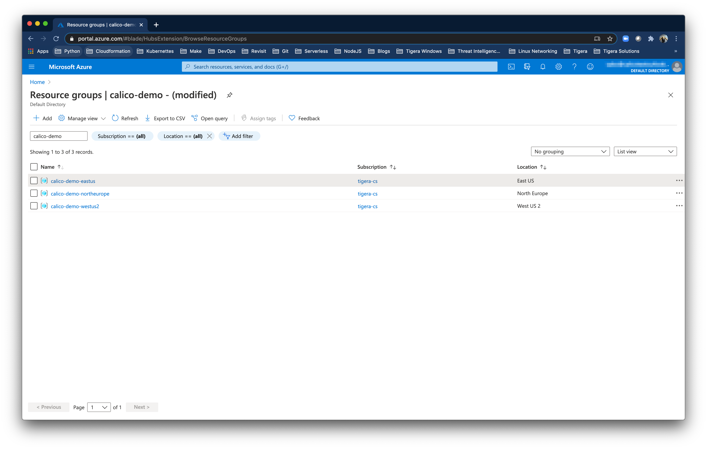
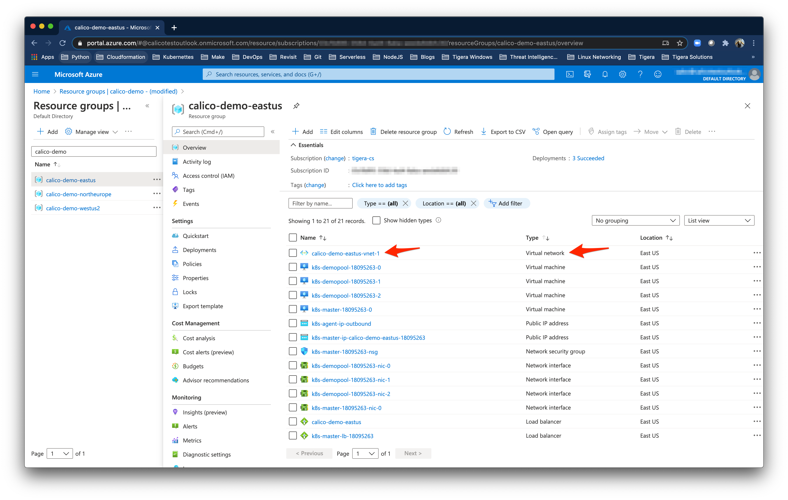
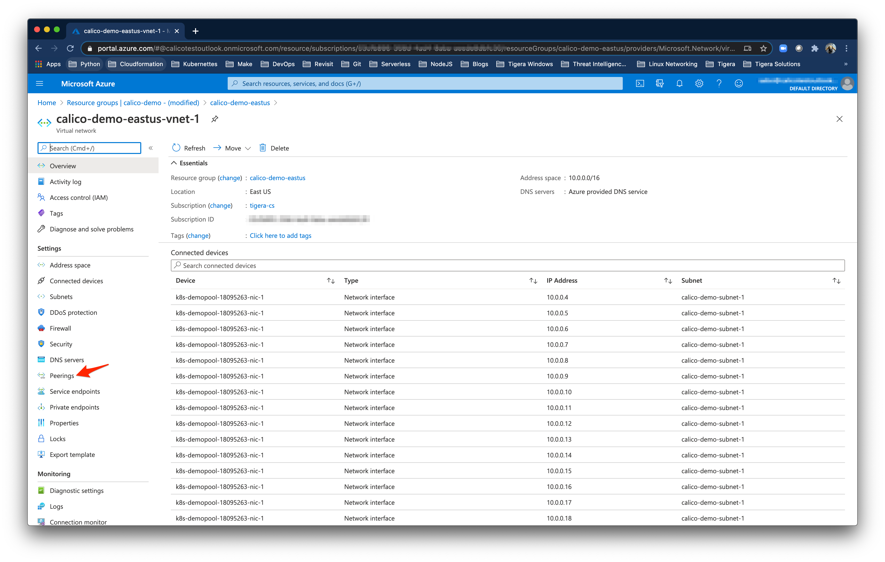
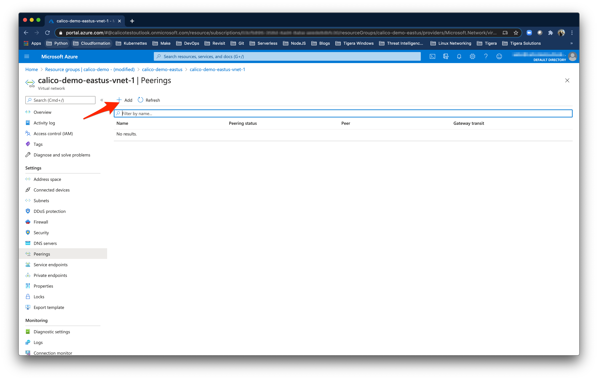
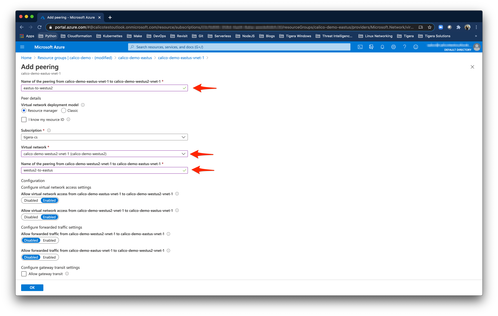
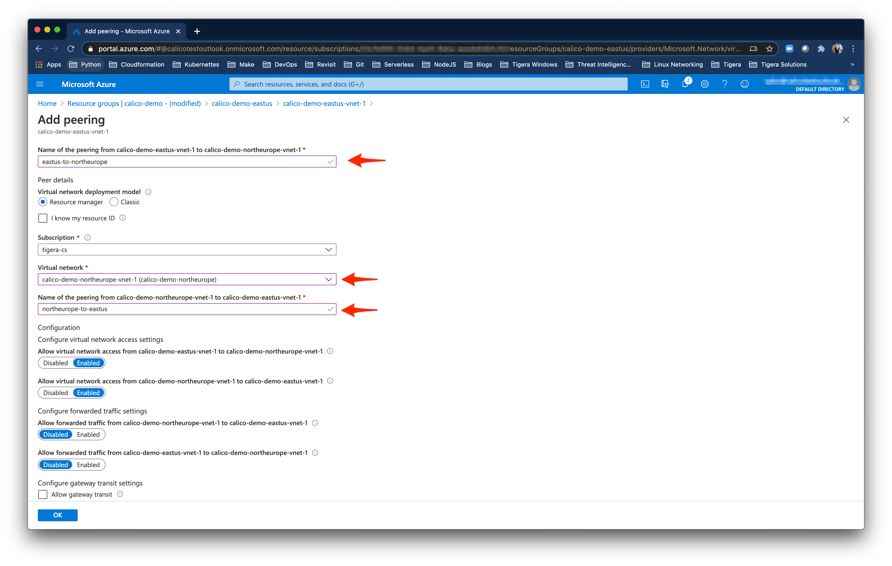
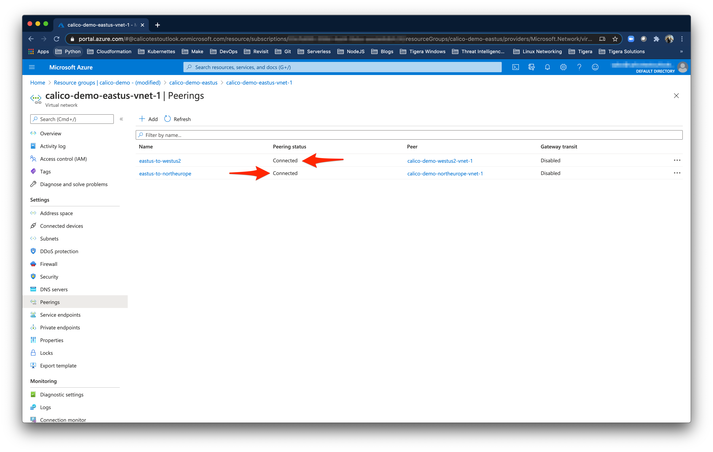
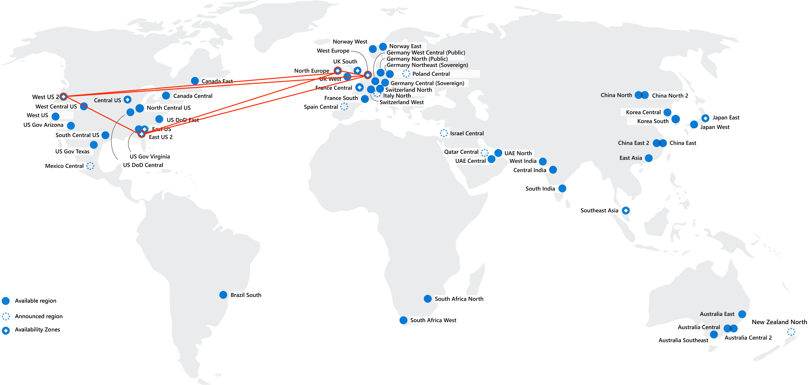
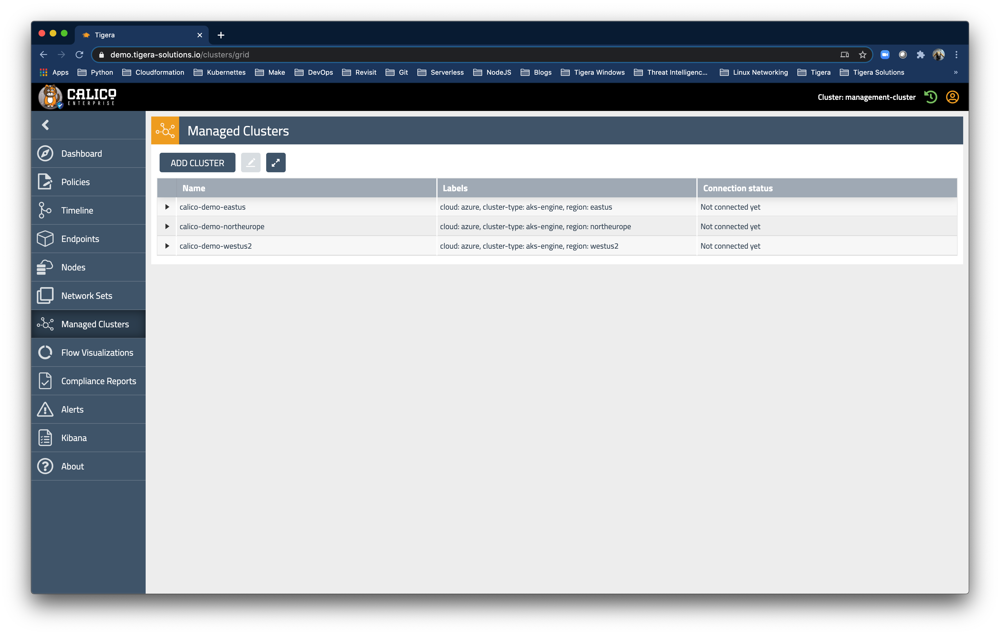

# azure-aks-mcm-federation

This content was built for free training workshops. 

If you're looking for general docs for Calico Enterprise, we recommend you start [here](https://docs.tigera.io)

## Create Azure resource groups for each region

```
az group create --name calico-demo-eastus --location eastus
az group create --name calico-demo-westus2 --location westus2
az group create --name calico-demo-northeurope --location northeurope
az group create --name calico-demo-westeurope --location westeurope
```

## Deploy Azure VNETS for each region

```
az deployment group create --name calico-demo-eastus-vnet --resource-group calico-demo-eastus --template-file aks.eastus-vnets.json
az deployment group create --name calico-demo-westus2-vnet --resource-group calico-demo-westus2 --template-file aks.westus2-vnets.json
az deployment group create --name calico-demo-northeurope-vnet --resource-group calico-demo-northeurope --template-file aks.northeurope-vnets.json
az deployment group create --name calico-demo-westeurope-vnet --resource-group calico-demo-westeurope --template-file aks.westeurope-vnets.json
```

## Deploy Kubernetes clusters into each region using aks-engine

```
aks-engine deploy --resource-group calico-demo-eastus --location eastus --api-model aks.eastus-engine.json --auth-method cli
aks-engine deploy --resource-group calico-demo-westus2 --location westus2 --api-model aks.westus2-engine.json --auth-method cli
aks-engine deploy --resource-group calico-demo-northeurope --location northeurope --api-model aks.northeurope-engine.json --auth-method cli
aks-engine deploy --resource-group calico-demo-westeurope --location westeurope --api-model aks.westeurope-engine.json --auth-method cli
```

## Configure bidirectional peering between each region



Inside each resource group select the VNET



Select Peerings



Add Peering



Peer VNETs in both directions for the first region



Add peering for the second region



Peering should be established between both remote regions



Peer the VNETs in second region


Peering should be established between the two remote regions


Peering should be established between all the regions


We should now have routed connectivity over Microsoft's backbone network between the Azure EastUS, WestUS2, NorthEurope, and WestEurope regions



## Deploy Calico Enterprise on each cluster

1. [Install Calico Enterprise on each cluster](https://docs.tigera.io/getting-started/kubernetes/managed-public-cloud/aks)

We're going to add each cluster to our pre-installed Multi-cluster Management cluster following the MCM [docs](https://docs.tigera.io/maintenance/mcm/configure).

Follow the documentation and complete the rest of the installation steps for each cluster.



## Deploy Calico Enterprise Federation for Kubernetes

1. [Create kubeconfig files](https://docs.tigera.io/networking/federation/kubeconfig)

Apply the Federation RBAC and service account for each cluster.

```
for REGION in eastus westus2 northeurope westeurope
do
export KUBECONFIG="$(pwd)/_output/calico-demo-$REGION/kubeconfig/kubeconfig.$REGION.json"
kubectl apply -f https://docs.tigera.io/getting-started/kubernetes/installation/federation-rem-rbac-kdd.yaml
kubectl apply -f https://docs.tigera.io/getting-started/kubernetes/installation/federation-remote-sa.yaml
done
```

Run the `create-remote-cluster-kubeconfigs.sh` to quicky create kubeconfigs for each cluster.

```
./create-remote-cluster-kubeconfigs.sh
```

2. [Configure access to remote clusters](https://docs.tigera.io/networking/federation/configure-rcc)

calico-demo-eastus

```
export KUBECONFIG="$(pwd)/_output/calico-demo-eastus/kubeconfig/kubeconfig.eastus.json"
kubectl create secret generic remote-cluster-secret-calico-demo-westus2 -n calico-system --from-literal=datastoreType=kubernetes --from-file=kubeconfig=calico-demo-westus2-kubeconfig
kubectl create secret generic remote-cluster-secret-calico-demo-northeurope -n calico-system --from-literal=datastoreType=kubernetes --from-file=kubeconfig=calico-demo-northeurope-kubeconfig
kubectl create secret generic remote-cluster-secret-calico-demo-westeurope -n calico-system --from-literal=datastoreType=kubernetes --from-file=kubeconfig=calico-demo-westeurope-kubeconfig
kubectl create -f remote-cluster-configuration-rbac.yaml
kubectl create -f remote-cluster-configuration-westus2.yaml
kubectl create -f remote-cluster-configuration-northeurope.yaml
kubectl create -f remote-cluster-configuration-westeurope.yaml
```

calico-demo-westus2

```
export KUBECONFIG="$(pwd)/_output/calico-demo-westus2/kubeconfig/kubeconfig.westus2.json"
kubectl create secret generic remote-cluster-secret-calico-demo-eastus -n calico-system --from-literal=datastoreType=kubernetes --from-file=kubeconfig=calico-demo-eastus-kubeconfig
kubectl create secret generic remote-cluster-secret-calico-demo-northeurope -n calico-system --from-literal=datastoreType=kubernetes --from-file=kubeconfig=calico-demo-northeurope-kubeconfig
kubectl create secret generic remote-cluster-secret-calico-demo-westeurope -n calico-system --from-literal=datastoreType=kubernetes --from-file=kubeconfig=calico-demo-westeurope-kubeconfig
kubectl create -f remote-cluster-configuration-rbac.yaml
kubectl create -f remote-cluster-configuration-eastus.yaml
kubectl create -f remote-cluster-configuration-northeurope.yaml
kubectl create -f remote-cluster-configuration-westeurope.yaml
```

calico-demo-northeurope

```
export KUBECONFIG="$(pwd)/_output/calico-demo-northeurope/kubeconfig/kubeconfig.northeurope.json"
kubectl create secret generic remote-cluster-secret-calico-demo-eastus -n calico-system --from-literal=datastoreType=kubernetes --from-file=kubeconfig=calico-demo-eastus-kubeconfig
kubectl create secret generic remote-cluster-secret-calico-demo-westus2 -n calico-system --from-literal=datastoreType=kubernetes --from-file=kubeconfig=calico-demo-westus2-kubeconfig
kubectl create secret generic remote-cluster-secret-calico-demo-westeurope -n calico-system --from-literal=datastoreType=kubernetes --from-file=kubeconfig=calico-demo-westeurope-kubeconfig
kubectl create -f remote-cluster-configuration-rbac.yaml
kubectl create -f remote-cluster-configuration-eastus.yaml
kubectl create -f remote-cluster-configuration-westus2.yaml
kubectl create -f remote-cluster-configuration-westeurope.yaml
```

calico-demo-westeurope

```
export KUBECONFIG="$(pwd)/_output/calico-demo-westeurope/kubeconfig/kubeconfig.westeurope.json"
kubectl create secret generic remote-cluster-secret-calico-demo-eastus -n calico-system --from-literal=datastoreType=kubernetes --from-file=kubeconfig=calico-demo-eastus-kubeconfig
kubectl create secret generic remote-cluster-secret-calico-demo-westus2 -n calico-system --from-literal=datastoreType=kubernetes --from-file=kubeconfig=calico-demo-westus2-kubeconfig
kubectl create secret generic remote-cluster-secret-calico-demo-northeurope -n calico-system --from-literal=datastoreType=kubernetes --from-file=kubeconfig=calico-demo-northeurope-kubeconfig
kubectl create -f remote-cluster-configuration-rbac.yaml
kubectl create -f remote-cluster-configuration-eastus.yaml
kubectl create -f remote-cluster-configuration-westus2.yaml
kubectl create -f remote-cluster-configuration-northeurope.yaml
```

## Deploy demo use cases to each region

```
for REGION in eastus westus2 northeurope westeurope
do
export KUBECONFIG="$(pwd)/_output/calico-demo-$REGION/kubeconfig/kubeconfig.$REGION.json"
kubectl apply -f apps/default/netshoot-$REGION.yaml -n default
kubectl apply -f apps/gdpr/netshoot-$REGION.yaml -n gdpr
done
```

Open a shell in each pod and attempt to ping from one ubuntu demo app to another across the globally disparate regions.

```
for REGION in eastus westus2 northeurope westeurope
do
export KUBECONFIG="$(pwd)/_output/calico-demo-$REGION/kubeconfig/kubeconfig.$REGION.json"
kubectl get pods -n default --show-lables
done
```

```
kubectl exec -it netshoot -- bash
ping POD_IP
```

## Multi Cluster Management Use Case: Enforce EU General Data Protection Regulation (GDPR) data residency requirements

### Examine the label taxonomy applied to each demo app

```
for REGION in eastus westus2 northeurope westeurope
do
export KUBECONFIG="$(pwd)/_output/calico-demo-$REGION/kubeconfig/kubeconfig.$REGION.json"
kubectl get pods -n gdpr --show-lables
done
```

| eastus | westus2 | westeurope | northeurope |
|-|-|-|-|
| app: ubuntu<br>region: eastus<br>location: virgina<br>geography: us<br>release-stage: dev | app: ubuntu<br>region: westus2<br>location: washington<br>geography: us<br>release-stage: prod | app: ubuntu<br>region: westeurope<br>location: netherlands<br>geography: eu<br>release-stage: dev | app: ubuntu<br>region: northeurope<br>location: ireland<br>geography: eu<br>release-stage: prod |

We will use the `geography` label to identify workloads running across our global set of clusters by physical location and security compliance requirements.  We'll use the federated workload identity to apply policy and control traffic.

### Examine the `enforce-gdpr-data-sovereignty` policy in the `complicance-controls` policy tier

```
for REGION in eastus westus2 northeurope westeurope
do
export KUBECONFIG="$(pwd)/_output/calico-demo-$REGION/kubeconfig/kubeconfig.$REGION.json"
kubectl apply -f felix
kubectl apply -f tiers
kubectl apply -f networkpolicy
done
```

```
cat networkpolicy/compliance-controls.enforce-gdpr-data-sovereignty.yaml
```

```
apiVersion: projectcalico.org/v3
kind: GlobalNetworkPolicy
metadata:
  name: compliance-controls.enforce-gdpr-data-sovereignty
spec:
  tier: compliance-controls
  order: 0
  selector: all()
  namespaceSelector: ''
  serviceAccountSelector: ''
  ingress:
    - action: Deny
      source:
        selector: geography != "eu"
      destination:
        selector: geography == "eu"
  egress:
    - action: Deny
      source:
        selector: geography == "eu"
      destination:
        selector: geography != "eu"
  doNotTrack: false
  applyOnForward: false
  preDNAT: false
  types:
    - Ingress
    - Egress
```

Open a shell in each pod and attempt to ping from one demo app to another across the globally disparate regions.

```
kubectl exec -it netshoot --  bash -n gdpr
ping POD_IP
```

## Multi Cluster Management Use Case: Global observabiilty

Open Kibana and search for denied flows.

Example the flow logs.  You should see the flows between clusters around the world.

The denied flows are an example of using identity based policy and global traffic control.

## Multi Cluster Management Use Case: Multi-region service failover

Coming soon...

## References

* Everything You Need To Know About Kubernetes Networking on Azure: https://youtu.be/JyLtg_SJ1lo
* Federation for Kubernetes: https://docs.tigera.io/networking/federation/overview
* Configure Calico Enterprise for multi-cluster management: https://docs.tigera.io/maintenance/mcm/configure
